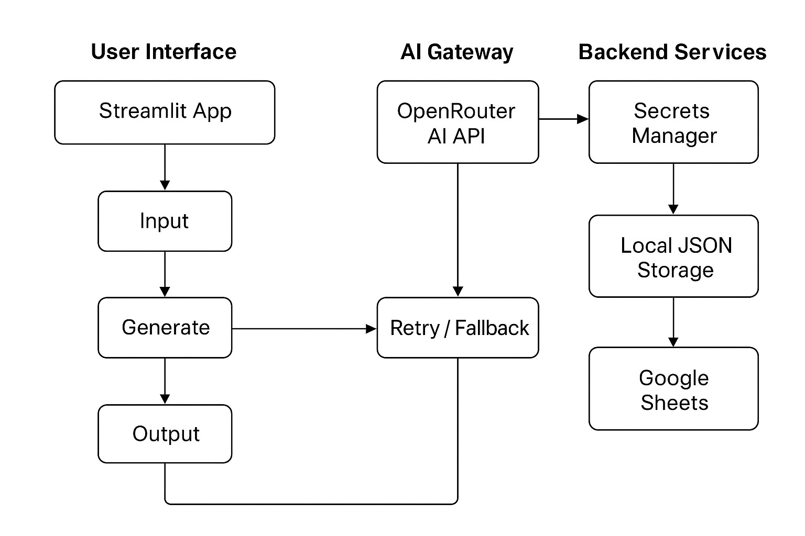

# Social Media Agent Architecture

This diagram illustrates the end-to-end architecture of the Social Media Content Generation Agent.

## System Overview

## Component Breakdown

### User Interface
* **Streamlit App:** The client-side application built with Streamlit, providing interactive forms and display areas.
* **Input:** User interaction elements like text boxes, dropdowns, and sliders for defining post parameters.
* **Generate:** The trigger for initiating AI content generation.
* **Output:** Displays the generated social media posts to the user.

### AI Gateway
* **OpenRouter AI API:** Acts as a unified interface to various LLMs.
* **Retry / Fallback:** Logic within your Python code to handle API failures, including retries and switching to a fallback model.

### Backend Services
* **Secrets Manager:** Securely handles API keys and credentials (e.g., `st.secrets` for OpenRouter and Google Sheets).
* **Local JSON Storage:** `saved_posts.json` for persistent storage of generated posts across sessions.
* **Google Sheets:** External service for exporting generated posts, using Google Sheets API and service account credentials.

## Data Flow Highlights

1.  User inputs parameters in the Streamlit UI.
2.  "Generate" button triggers the `generate_with_ai` function.
3.  `generate_with_ai` sends a request to OpenRouter API.
4.  The AI Gateway handles the LLM request, including retries and model fallback if needed.
5.  Generated content is returned to the Streamlit App.
6.  User can then see the output, save it to local JSON, or export it to Google Sheets.